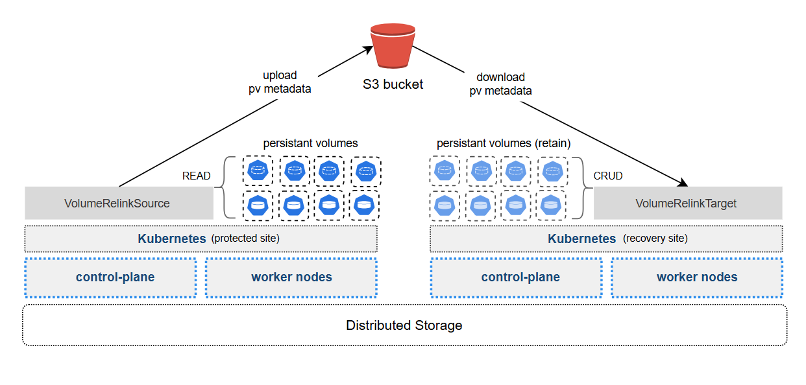

# relink-operator

A lightweight, concurrent Kubernetes operator built in Rust using the `kube-genops` and `kube-objstore` crates. It automates disaster recovery (DR) storage states by syncing PersistentVolume (PV) metadata across protected and recovery clusters via object storage.

## Overview

The `relink-operator` solves the "orphaned volume" problem during cross-cluster failovers. Instead of manually patching bi-directional storage bindings (`spec.claimRef`) during an outage, this operator splits the lifecycle into two concurrent, decoupled controller loops managed by Custom Resource Definitions (CRDs):

1. **`VolumeRelinkSource` (Protected Cluster):** Watches active PVC/PV states matching specified selectors, captures their volume mapping metadata, and pushes state snapshots to an S3-compatible object storage bucket.
2. **`VolumeRelinkTarget` (Recovery Cluster):** Sits in a standby loop monitoring the object storage bucket. When a failover event is explicitly triggered, it automatically pulls down the metadata, clears out conflicting binding definitions, and pre-binds the existing cloud volumes to newly instantiated PVCs.